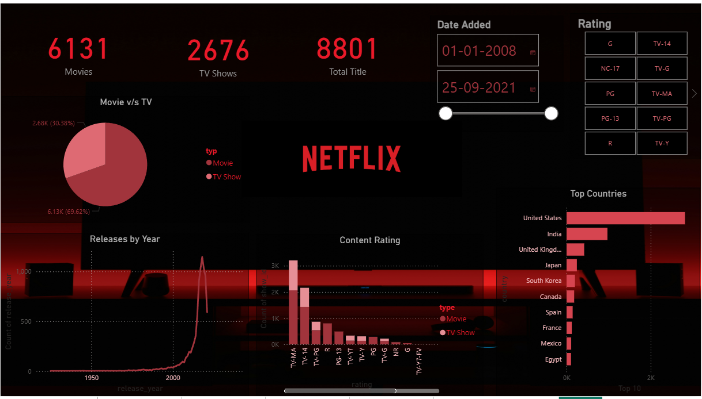

# Netflix Content Analysis Dashboard

This project analyzes the Netflix content catalog to understand trends in movies and TV shows available on the platform. The dashboard provides interactive visualizations that allow users to explore content distribution, ratings, release trends, and geographic production patterns.

The goal of this project is to practice data analysis, data visualization, and dashboard design using Power BI while extracting meaningful insights from real-world entertainment data.

## Dashboard Preview



## Key Metrics

The dashboard highlights the following important metrics:

- Total Movies: 6,131

- Total TV Shows: 2,676

- Total Titles: 8,801

## Dashboard Features

The dashboard includes several visualizations designed to explore the dataset from different perspectives:

1. Movie vs TV Show Distribution
A pie chart showing the proportion of movies and TV shows available on Netflix.

2. Content Release Trends
A time-series visualization showing how the number of titles released has changed over the years.

3. Content Rating Distribution
A breakdown of titles by rating categories such as TV-MA, TV-14, PG, PG-13, and others.

4. Top Content Producing Countries
A ranking of countries that contribute the most titles to the Netflix catalog.

5. Interactive Filters
Users can explore the data further using:

    - Date Added filter

    - Rating filter

## Key Insights

Some insights observed from the analysis include:

- Movies make up the majority of Netflix content, significantly outnumbering TV shows.

- There is a rapid growth in content after 2015, reflecting Netflix's aggressive expansion in original and licensed content.

- TV-MA and TV-14 are the most common content ratings, indicating a large portion of the platform targets mature audiences.

- The United States leads in content production, followed by India and the United Kingdom.

## Tools & Technologies

- Power BI – Data visualization and dashboard creation

- Power Query – Data cleaning and transformation

- Excel / CSV Dataset – Data source

## Dataset Information

The dataset contains information about Netflix titles, including:

- Title

- Type (Movie or TV Show)

- Country

- Release Year

- Rating

- Date Added

- Duration

- Genre

## Project Purpose

The purpose of this project is to demonstrate:

- Data cleaning and transformation

- Exploratory data analysis

- Data visualization

- Dashboard storytelling

It showcases how raw entertainment data can be transformed into an interactive analytical dashboard.

``` Repository Structure
Netflix-Content-Dashboard
│
├── dataset
│   └── netflix_titles.csv
│
├── dashboard
│   └── Netflix_Dashboard.pbix
│
├── images
│   └── dashboard_preview.png
│
└── README.md
Author

This project is part of my journey of building a data analytics portfolio and improving my skills in data visualization and storytelling with Power BI.

If you want, I can also show you one small trick that makes a GitHub data project look much more professional to recruiters (almost every strong data analyst repo uses it).


